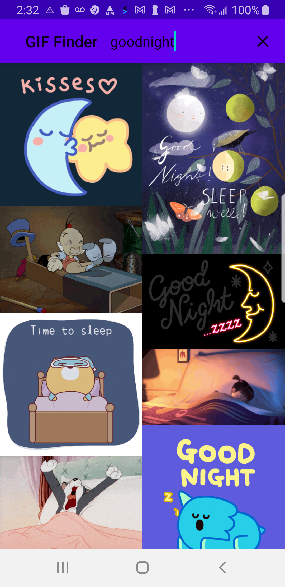

# GIF-Finder
Find GIF images and share with friends.  super fun!  

<a href="https://github.com/kkawai/GIF-Finder/blob/main/KOTLIN/GIF-Finder-Kotlin/">New version written in Kotlin</a>

[See GIF Finder on Google Play Store](https://play.google.com/store/apps/details?id=com.kk.android.fuzzy_waddle)

